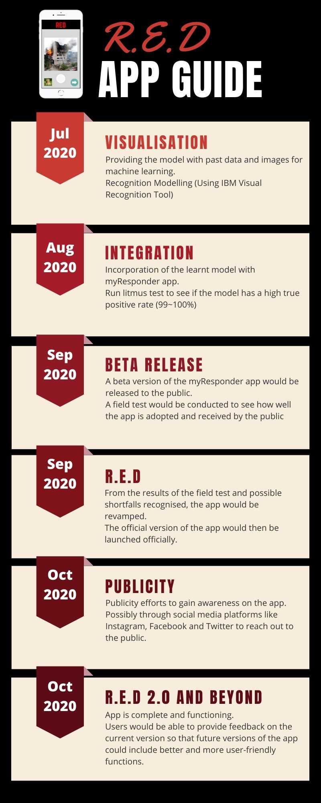

# TeamTitan_R.E.D_SCDFXIBM

## Short Description

### Problem: 
Manually assessing photos of onsite information before pushing out notifications to CFRs can be faster.
### How can technology help: 
Speed up photo classification and assessment, pushing out notifications simultaneously. Visual Recognition of the photos will allow quicker assessment, resulting in simultaneous notification of SCDF personnel, CFRs and non-CFRs, bridging the time lag of manually assessing and pushing out notifications thereafter.
### The idea:
Visual Recognition Tool to reduce assessment time and to reduce burden on emergency hotline.

## Pitch Video
[](-insert video link-)

## Architecture of Proposed Solution


1. User reports a fire with a picture using an app
2. App interface receives image and queries Google Maps for geolocation
3. Google Maps finds geolocation of user and replies to app interface
4. App interface receives geolocation and calls IBM Watson Visual Recognition service
5. Visual Recognition service uses machine learning to classify fire immage
6. Visual Recognition queries and classify using available fire images
7. Geolocation of user and classification of fire is sent to SCDF for appropriate response
8. App interface receives completion of task from Visual Recognition and broadcast message to nearby civilians and user
9. User receives appropriate message from app interface informing of completion of request depending on whether user is CFR or civilian
10. Nearby civilians receives appropriate message as an SMS from app interface

## Long Description
[More details regarding our application](DESCRIPTION.md)

## Project roadmap



## Getting Started

### Image Classification Setup
Visit this [link](https://cloud.annotations.ai/workshops/classification/index.html) to create your own image classification bucket.

### Setup
`git clone` the repo and `cd` into it by running the following command:

```bash
git clone https://github.com/cloud-annotations/classification-ios.git
cd classification-ios
```

### Add your model files to the project
Copy the `model_ios` directory generated from the classification walkthrough and paste it into the `classification-ios/Core ML Classification` folder of this repo.

### Install Xcode
In order to develop for iOS we need to first install the latest version of Xcode, which can be found on the [Mac App Store](https://itunes.apple.com/us/app/xcode/id497799835?mt=12)

### Open the project with Xcode
Launch Xcode and choose **Open another project...**


Then in the file selector, choose `classification-ios`.

### Test the application in the simulator
Now we’re ready to test! First we’ll make sure the app builds on our computer, if all goes well, the simulator will open and the app will display.

To run in the simulator, select an iOS device from the dropdown and click **run**.


### Or run the app on an iOS device
Since the simulator does not have access to a camera, and the app relies on the camera to test the classifier, we should also run it on a real device.


1. Select the project editor (*The name of the project with a blue icon*)
1. Under the **Signing** section, click **Add Account**

1. Login with your Apple ID and password

1. *You should see a new personal team created*
1. Close the preferences window

Now we have to create a certificate to sign our app with
1. Select **General**
1. Change the **bundle identifier** to `com.<YOUR_LAST_NAME>.Core-ML-Vision`

1. Select the personal team that was just created from the **Team** dropdown
1. Plug in your iOS device
1. Select your device from the device menu to the right of the **build and run** icon
1. Click **build and run**
1. On your device, you should see the app appear as an installed appear
1. When you try to run the app the first time, it will prompt you to approve the developer
1. In your iOS settings navigate to ***General > Device Management***
1. Tap your email, tap **trust**

Now you're ready to run the app!

## Built with
* [IBM Cloud Annotations](https://cloud.annotations.ai/) - Building an image classification instance
* [IBM Cloud](https://cloud.ibm.com/) - Create a machine learning instance
* [Xcode](https://developer.apple.com/xcode/) - To run and test the application on the simulator interface
